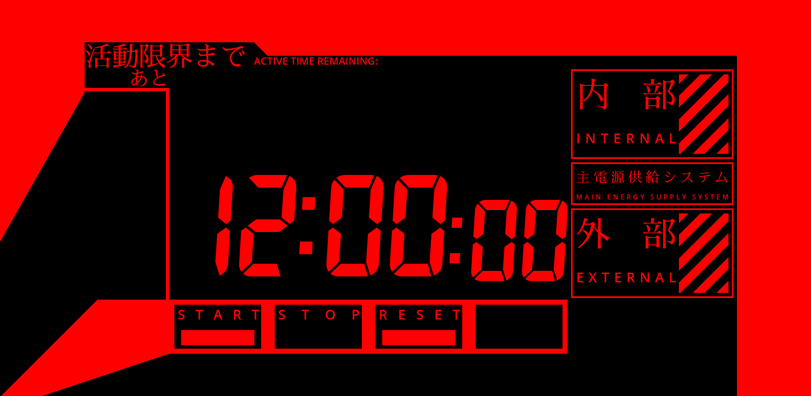

# EVA POMODORO

A pomodoro timer inspired by Evangelion



## Getting Started

First, install the dependencies:

```bash
pnpm install
```

Then, run the development server:

```bash
pnpm dev
```

Open [http://localhost:3000](http://localhost:3000) with your browser to see the result.

## Deployment on Vercel

The easiest way to deploy this Next.js app is to use the [Vercel Platform](https://vercel.com/new).

1. Push this repository to GitHub
2. Import the repository on Vercel
3. Vercel will detect it's a Next.js app and use the optimal build settings automatically

For optimal deployment with pnpm, add the following to your Project Settings in Vercel:

- Build Command: `pnpm build`
- Install Command: `pnpm install`

## Usage

You can set up the timer with the URL query parameter.

|   query   |           value           |
| :-------: | :-----------------------: |
|   time    | remaining time of minutes |
| stopwatch |       not required        |

### Example

12 minutes timer:

```
https://eva.0xechan.xyz/?time=12
```

stopwatch mode:

```
https://eva.0xechan.xyz/?stopwatch
```

### Control Buttons

The timer includes the following control buttons:

- **STOP**: Pauses the current countdown
- **SLOW**: Sets a longer countdown timer
- **NORMAL**: Sets a medium countdown timer
- **RACING**: Sets a short countdown timer

Clicking any of the time mode buttons will automatically start the timer with the selected duration.

## Features

### Glitch Effect

The timer includes a visual glitch effect inspired by the Evangelion anime series. The glitch effects include:

- Random text distortion effects that occur periodically
- Scanlines overlay for a retro screen look
- Noise texture for an authentic old display feel
- Screen flicker effects
- Increased glitch intensity when the timer reaches zero

These effects enhance the Evangelion aesthetic and add to the immersive experience.

### SEO Optimization

This project includes several SEO optimizations:

- Rich metadata for improved search engine visibility
- Open Graph tags for better social media sharing
- Twitter Card support for Twitter sharing
- Semantic HTML structure with proper accessibility
- Schema.org structured data for enhanced search results
- Proper title and description tags
- Sitemap.xml and robots.txt for improved crawling

### Analytics

The project uses Google Analytics to track usage data:

- Pageviews and user sessions tracking
- User interaction analytics
- Performance monitoring

## Author

[Hagi](https://github.com/iPolyomino)

## Fonts

- https://torinak.com/7segment
- https://fonts.google.com/

## License

This project is licensed under the MIT License - see the [LICENSE](LICENSE) file for details.

Copyright (c) 2020 [Hagi](https://github.com/iPolyomino)
